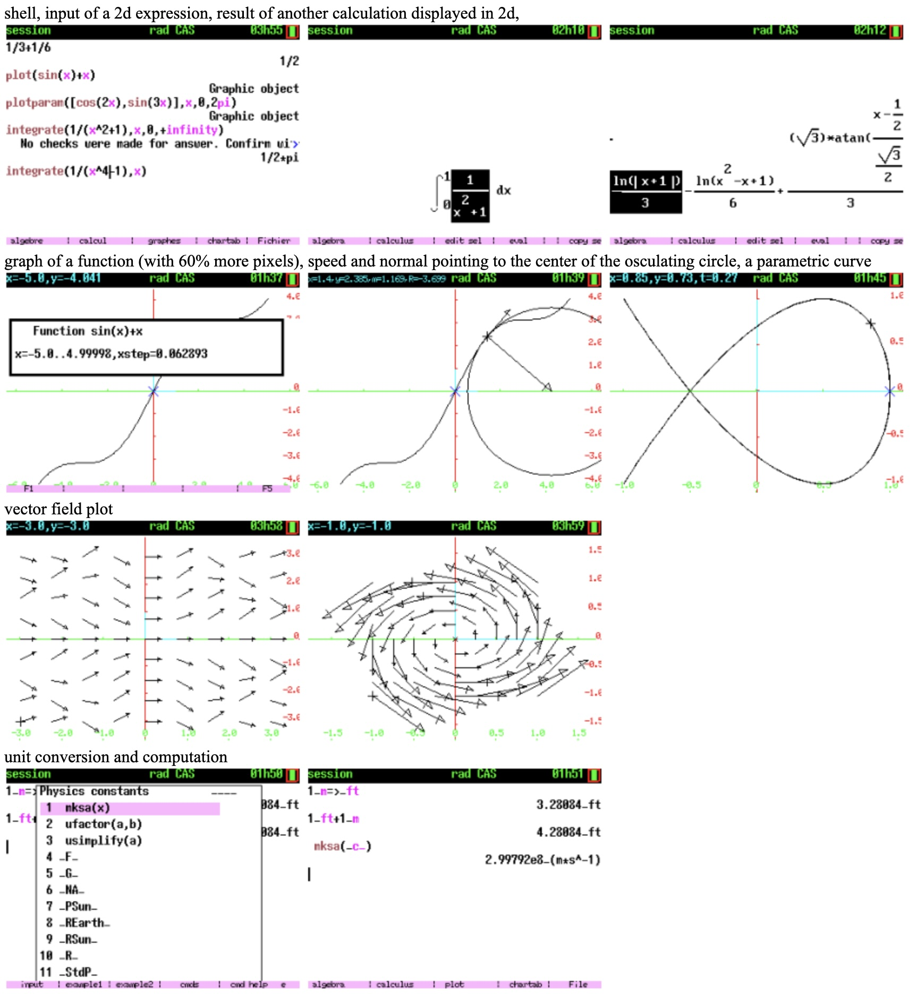

# KhiCAS CE

**An XCAS port for the TI-84 Plus CE / TI-83 Premium CE calculators.**

## Compilation:

### Prerequisites

- Get the nightly CE toolchain https://github.com/CE-Programming/toolchain/releases/nightly  
(See docs: https://ce-programming.github.io/toolchain/)

- `g++` and `python3` are also required for the post-build steps.

### KhiCAS build

Run the `./mkappen` (English build) or `./mkappfr` (French build) script.

It will create, in the bin/ folder, many appvars (.8xv files) and an installer (.8xp).  
A bundle file (.b83/.b84), only usable on TI Connect CE for Windows, will also be created with those files.

## Installation on calculator:
See [install_en.txt](install_en.txt) or [install_fr.txt](install_fr.txt).

## Build customization:
Some compile flags control the inclusion of parts of the code.

The total app size ranges from 2.2MB to 2.8MB, approximately.
* math:
  * `-DWITH_LAPLACE`  Laplace/inverse Laplace transform ≈ 20K
  * `-DWITH_DESOLVE`  desolve command ≈ 60K (including Laplace)
* science:
  * `-DWITH_PERIODIC` periodic table ≈ 10K
  * `-DWITH_UNITS` physical units ≈ 40K

Note that 2 apps do never share a flash page, as a consequence you can
add space up to a multiple of 65.536, e.g. 2260 KB and 2280 KB will
leave free the same amount of flash.
